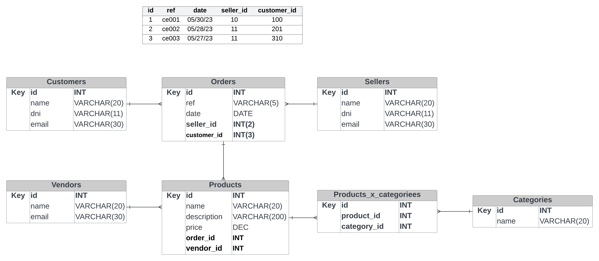

# Undefined Academy FullStack JS BootCamp

## Week 9: Declarative languages and Databases

### Practice

1. Create an Entity Relationship Diagram for an inventory system
2. This ERD should contain at least Orders, Products, Customers and Sellers

### Solution

### Tools

- SQL
- Lucidchart
- Visual Studio Code
- Git

### Acknowledgements

Guillermo Rodas
